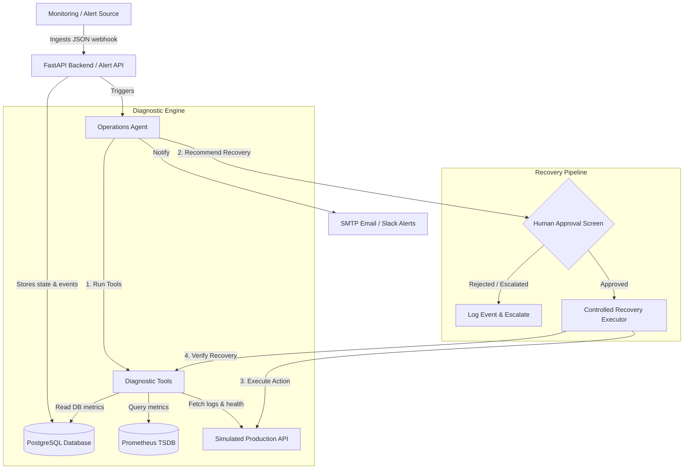
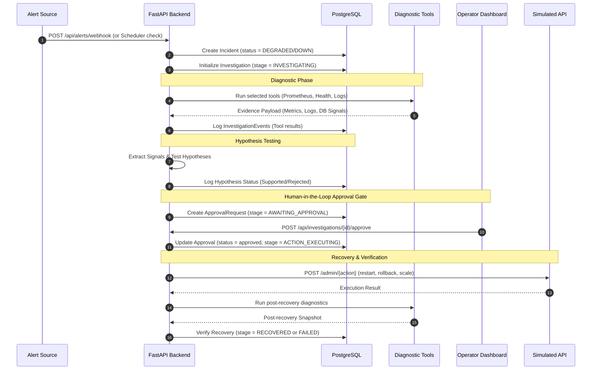

# Architecture & Design Document

This document explains the technical architecture, operational flows, safety boundary design, and diagnostic tools implemented in the **Autonomous DevOps Reliability Agent**.

---

## 1. High-Level System Architecture

The Reliability Agent operates as a self-contained monitoring, diagnostics, and recovery system within a sandboxed simulated infrastructure. It is designed to run in a Dockerized environment and integrates the following core components:

### Core Components
1. **FastAPI Backend (`reliability-api`)**: Serves as the central API gateway. It exposes alert ingestion endpoints, investigation dashboard APIs, action approval endpoints, and triggers scheduled checks.
2. **Simulated Production API (`simulated-api`)**: A Python-based microservice that simulates application workloads, responds to API events, records mock container states, and exposes administrative action endpoints (restart, scale, rollback).
3. **Prometheus**: Aggregates metric timeseries scraped from the simulated API. It is used as the primary data source for request rates, error percentages, and latency diagnostics.
4. **PostgreSQL**: Stores persistent investigation state, event timelines, approvals, incidents, and recovery logs.
5. **Grafana**: Provides visual dashboards mapping the health metrics and database status.

---

## 2. Investigation and Recovery Pipeline

When an alert is received (either via the Grafana webhook or the internal scheduler detecting an anomaly), the agent initiates a stateful investigation:

---

## 3. Diagnostic Tools & Signals

The agent utilizes read-only diagnostic tools to inspect specific resource layers:

| Tool Name | Source | Description | Read-Only? |
| :--- | :--- | :--- | :--- |
| **Service Health** | `GET /health` | Fetches live HTTP health status, application version, and active chaos scenario. | Yes |
| **Prometheus Metrics** | `GET /api/v1/query` | Queries request rates, P95 latencies, and 5xx/4xx error percentages over a 30s window. | Yes |
| **Structured Logs** | `GET /internal/logs` | Retrieves recent log streams, error messages, and trace correlation IDs. | Yes |
| **Container Health** | `GET /internal/container` | Inspects Docker container lifecycle details (state, health status, and restart counts). | Yes |
| **Database Diagnostics**| `GET /internal/database` | Checks database availability, query latency, and active connection signals. | Yes |
| **Deployment History** | `GET /internal/deployment`| Checks the current deployment version and timestamps of recent updates. | Yes |

---

## 4. Safety & Policy Model

Safety is enforced through architectural constraints and deterministic policy engines:

- **Strict Read-Only Diagnostics**: None of the diagnostic tools are capable of executing SQL queries or mutating resources. All inputs are strictly sanitized.
- **High-Impact Action Whitelist**: Only predefined administrative actions (`restart`, `rollback`, `scale`, `modify_config`, `delete_resource`, `recreate`) are allowed. Any other command is rejected at the API gate.
- **Approval Enforcement**: All high-impact actions must be explicitly approved via `/api/investigations/{id}/approve` by a human operator. The backend prevents direct execution of these actions.
- **Direction-Change Logic**: If the initial hypothesis (e.g. `deployment_regression` after a recent deploy) is disproved by log/metric evidence (e.g. no deployment errors but database connection timeouts), the agent automatically shifts its hypothesis focus to database failures and changes its recommendation accordingly.
- **Graceful LLM Fallback**: If the LLM agent is rate-limited or offline, the system falls back to a deterministic python-based rules engine to prevent investigation failures.

---

## 5. Alerting and Integration Channels

When incidents are generated or recovery is completed, the agent fires alerts over two configured notification channels:
1. **Email (SMTP)**: Sends formatted notification messages containing incident metadata, severity level, current metrics, and detailed diagnostic reasoning.
2. **Slack Integration**: Publishes rich Slack blocks outlining the incident details, active investigation status, likely cause, and recommendations directly to Slack channels.
