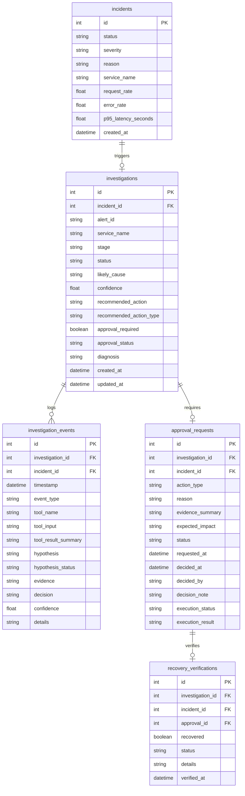

# Database Schema & State Transitions

This document describes the PostgreSQL database schema, table structures, entity relationships, and state machine transitions used by the **Autonomous DevOps Reliability Agent**.

---

## 1. Entity Relationship Diagram

The database utilizes five relational tables to track the complete lifecycle of alerts, incidents, tool executions, operator approvals, and recovery verifications:



---

## 2. Table Column Reference

### `incidents` Table
Stores high-level reliability anomalies detected by the scheduler or external alerts.
* **`id`** (`int`, Primary Key): Auto-incrementing identifier.
* **`status`** (`string`): The overall service health (`HEALTHY`, `DEGRADED`, `DOWN`).
* **`severity`** (`string`): Severity ranking (`LOW`, `MEDIUM`, `HIGH`, `CRITICAL`).
* **`reason`** (`string`): The analysis text/diagnosis explaining the incident.
* **`service_name`** (`string`): The targeted service (default: `simulated-api-service`).
* **`request_rate`** (`float`): Request rate at incident creation time.
* **`error_rate`** (`float`): 5xx error rate percentage.
* **`p95_latency_seconds`** (`float`): P95 request latency in seconds.

### `investigations` Table
Tracks active agent diagnoses, hypotheses, and current stages.
* **`id`** (`int`, Primary Key): Investigation identifier.
* **`incident_id`** (`int`, Foreign Key): Associated incident ID.
* **`alert_id`** (`string`): Fingerprint or UUID of the triggering alert.
* **`stage`** (`string`): Active pipeline stage (see state machine below).
* **`status`** (`string`): Current resolution status.
* **`likely_cause`** (`string`): The accepted hypothesis category (e.g. `deployment_regression`).
* **`confidence`** (`float`): Agent diagnosis confidence level (0.0 to 1.0).
* **`recommended_action`** (`string`): Written recommendation details.
* **`recommended_action_type`** (`string`): Recovery action type (`restart`, `rollback`, `scale`, `observe`, `escalate`).
* **`approval_required`** (`boolean`): True if action requires manual approval.
* **`approval_status`** (`string`): Approval state (`not_required`, `pending`, `approved`, `rejected`).
* **`diagnosis`** (`string`): Summary of diagnostic facts.

### `investigation_events` Table
Audit trail logging every tool execution, input parameter, result snapshot, and hypothesis tested.
* **`event_type`** (`string`): Event type (`alert_received`, `tools_selected`, `diagnostic_step`, `hypothesis`, `diagnosis`, `recommendation`, `approval_requested`, `approval_decision`, `action_executed`, `recovery_verification`).
* **`tool_name`** / **`tool_input`** / **`tool_result_summary`**: Details of diagnostic tool operations.
* **`hypothesis`** / **`hypothesis_status`**: Hypothesis under test and status (`supported`, `rejected`).
* **`decision`** / **`details`**: Explanatory text and operation parameters.

### `approval_requests` Table
Records human-in-the-loop approvals before high-impact recovery actions are triggered.
* **`action_type`** (`string`): Type of recovery action requested.
* **`status`** (`string`): Approval status (`pending`, `approved`, `rejected`).
* **`decided_by`** / **`decision_note`**: Operator name and comments.
* **`execution_status`** (`string`): Status of command execution (`blocked`, `executed`, `failed`).

### `recovery_verifications` Table
Records post-recovery health checks and confirmation of recovery success.
* **`recovered`** (`boolean`): True if service returned to normal metrics.
* **`status`** (`string`): Verified status (`HEALTHY`, `DEGRADED`, etc.).

---

## 3. Investigation Stage & Status State Machine

The investigation workflow moves through the following stages:

```text
       [Anomaly / Webhook Alert]
                  │
                  ▼
            INVESTIGATING
                  │
                  ├───────────────────────────────┐
                  ▼                               ▼
              DIAGNOSING                  AWAITING_APPROVAL
                  │                               │
                  │ (Requires no approval)        ├─── [Rejected] ───► ESCALATED / REJECTED
                  │                               │
                  ▼                               ▼ (Approved)
            [Read-only Action]             ACTION_EXECUTING
                  │                               │
                  │                               ▼
                  └─────────────────────────►  VERIFYING
                                                  │
                                   ┌──────────────┴──────────────┐
                                   ▼                             ▼
                               RECOVERED                       FAILED
```

### Transition Definitions
1. **`INVESTIGATING`**: The agent has created the investigation. It is executing initial diagnostic tools (Metrics, logs).
2. **`DIAGNOSING`**: The agent is executing follow-up tools, evaluating evidence, and generating hypotheses.
3. **`AWAITING_APPROVAL`**: A high-impact recovery action is recommended. Execution is blocked, awaiting manual operator intervention.
4. **`ACTION_EXECUTING`**: The operator has clicked Approve. The controlled recovery action is dispatched to the Simulated API.
5. **`VERIFYING`**: The recovery action completed. The agent is capturing post-recovery metrics.
6. **`RECOVERED`**: Verification checked successfully. Metrics are normal.
7. **`FAILED`**: Recovery action failed or metrics remained abnormal.
8. **`ESCALATED`**: The operator rejected the recovery action, or the agent stopped due to insufficient evidence.
